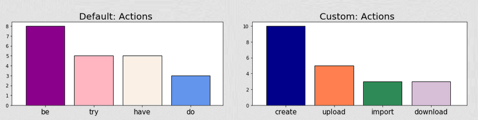

# CASCON 2019 NLP workshop - replay 2020

As the use of Natural Language Processing (NLP) to process text becomes ubiquitous - from social media apps to job applications - understanding the basics of how meaning is extracted from text is crucial.

In this hands-on workshop, you will learn how to use IBM Watson services to extract meaning from sample text.

&nbsp;

## Workshop prerequisites
**Before starting the workshop**, create an IBM Cloud account (free) and provision an instance (lite plan) of Watson Studio (if you don't already have these):
<ol>
<li>

Create an IBM Cloud account 
<a href="https://cloud.ibm.com/login">IBM Cloud login</a>

</li>
<li>

Provision an instance of IBM Watson Studio 
<a href="https://cloud.ibm.com/catalog/services/watson-studio">IBM Watson Studio</a>

</li>
</ol>

If you have any trouble completing these prerequisites, feel free to email us for help:

Sarah Packowski 
<a mail="spackows@ca.ibm.com">spackows@ca.ibm.com</a>

Ashley Zhao 
<a mail="Ashley.Zhao@ibm.com">Ashley.Zhao@ibm.com</a>

&nbsp;

## Handy links

<ul>
<li>

<a href="https://cloud.ibm.com/resources">IBM Cloud dashboard</a>

</li>
<li>

<a href="https://dataplatform.cloud.ibm.com/home">IBM Watson Studio web GUI</a>

</li>
</ul>

&nbsp;

## Workshop instructions

Friday, June 3, 2020

In this practical, hands-on workshop, you will use IBM Watson Natural Language Understanding to extract meaning from sample text in a Python notebook in IBM Watson Studio using default, general language models as well as a custom language model.

See: [Instructions](./Instructions.md)

&nbsp;

