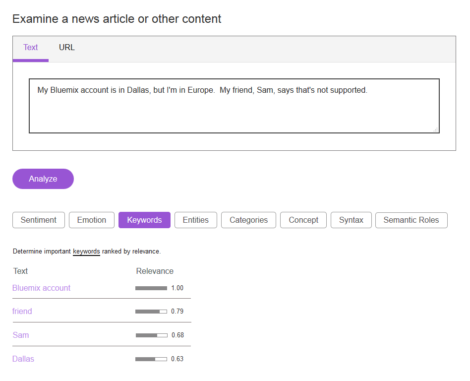
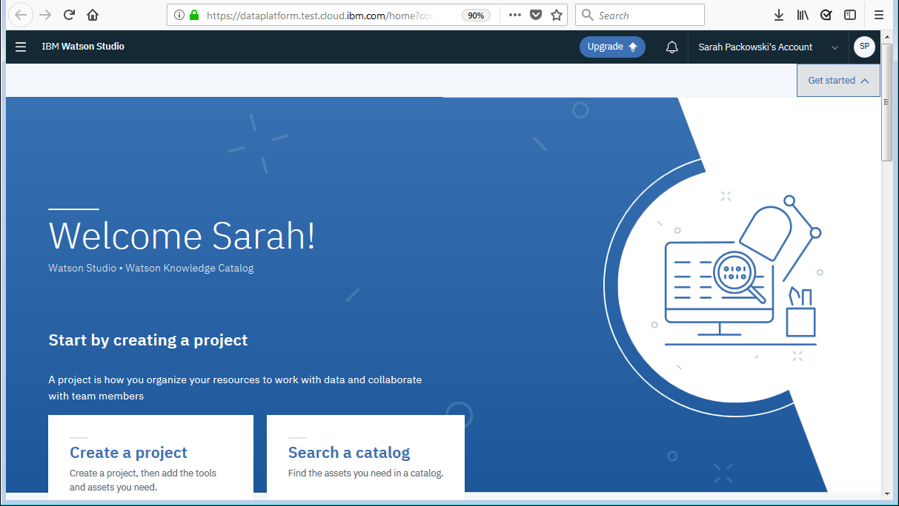
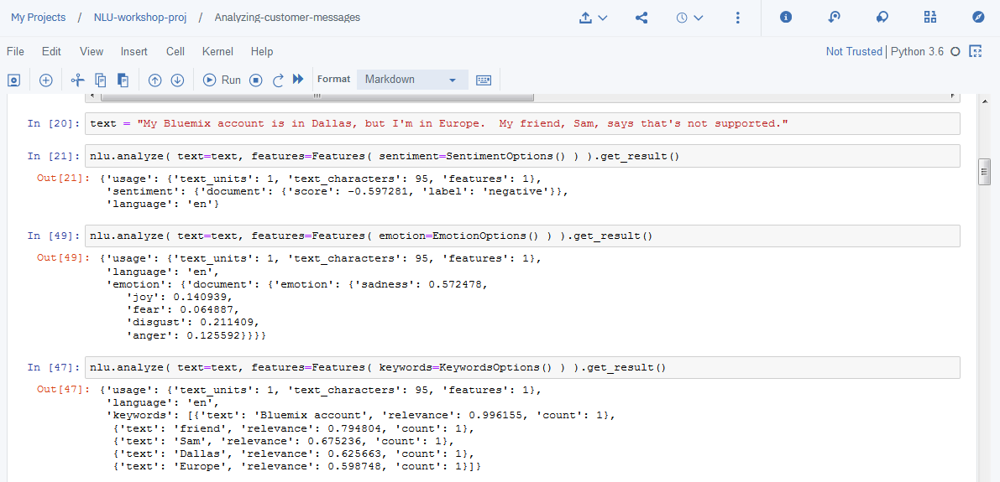
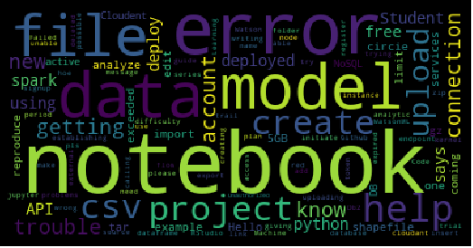

# NLP Hands-on Workshop Series Session 1

**Extracting meaning from text using a notebook in Watson Studio**

## Section A
A great way to learn about the basic concepts and terms related to IBM Watson Natural Language Understanding is to explore the demo app: [https://natural-language-understanding-demo.ng.bluemix.net/](https://natural-language-understanding-demo.ng.bluemix.net)

In the demo app, you can explore:
- **Sentiment** - positive/negative
- **Emotion** - joy, anger, disgust, sadness, fear
- **Keywords** - list important words
- **Entities** - "type" of keywords - eg. Location, Quantity, Sport
- **Categories** - hierarchical taxonomy - eg. arts & entertainment &rarr; books &rarr; poetry
- **Concepts** - phrases that indicate what the text is about
- **Syntax** - part of speech - eg. verb, adjective
- **Semantic roles** - subject, action, object

See: [Text analytics features](https://cloud.ibm.com/apidocs/natural-language-understanding#text-analytics-features)

&nbsp;

### Section B
Create a project in Watson Studio and add the first sample notebook to the project.

<ol>
<!-- step -->
<li>

In Watson Studio, create a new <b>empty</b> project.

</li>
<!-- step -->
<li>

Add the first sample notebook to your project:

<ol>
<li>On the <b>Assets</b> page in Watson Studio, click <b>Add to project</b></li>
<li>Select <b>Notebook</b></li>
<li>Select <b>From URL</b></li>
<li>Name the notebook (eg. "Exploring NLU")</li>
<li>Accept the default runtime: "Default Python 3.6 XS (2 vCPU and 8GB RAM)"</li>
<li>Paste this URL in the <b>Notebook URL</b> text box: <a href="https://github.com/spackows/CASCON-2019_NLP-workshops/blob/master/notebooks/Notebook-1_Exploring-NLU.ipynb">Notebook URL</a></li>
<li>Click <b>Create Notebook</b></li>
</ol>

The notebook opens in edit mode after it is loaded.

</li>
</ol>

&nbsp;

### Section C

Analyze customer questions and comments in the notebook.

<ol>
<!-- step -->
<li>

Add the NLU service apikey:

<ol>
<li>From the <b>Services</b> menu in Watson Studio, right-click "Watson Services" and then open the link in a new browser tab</li>
<li>In the new Watson services tab, from the <b>Action</b> menu beside the Natural Language Understanding instance, select "Manage in IBM Cloud"</li>
<li>In the service details page that opens, click <b>Service credentials</b>, then expand credentials to view them, and then copy the apikey</li>
</ol>
</li>
<!-- step -->
<li>

Run the <code>code</code> cells in the notebook <b>in order, starting at the top</b>.

<ol>
<li>Explore text analytics features with a sample test message</li>
<li>Import sample customer messages</li>
<li>Analyze sample customer messages - keywords and semantic roles</li>
</ol>
</li>
</ol>

For reference, here is a link to the sample customer message data set: <a href="https://dataplatform.cloud.ibm.com/exchange/public/entry/view/015ddef6a868441188268a123404f744">Customer messages</a>

&nbsp;

### Section D
Visualize analysis results in the second notebook.

<ol>
<!-- step -->
<li>

Add the second sample notebook to the project:

<ol>
<li>On the <b>Assets</b> page in Watson Studio, click <b>Add to project</b></li>
<li>Select <b>Notebook</b></li>
<li>Select <b>From URL</b></li>
<li>Name the notebook (eg. "Visualizing NLU results")</li>
<li>Accept the default runtime: "Default Python 3.6 XS (2 vCPU and 8GB RAM)"</li>
<li>Paste this URL in the <b>Notebook URL</b> text box: <a href="https://github.com/spackows/CASCON-2019_NLP-workshops/blob/master/notebooks/Notebook-2_Visualizing-NLU-results.ipynb">Notebook URL</a></li>
<li>Click <b>Create Notebook</b></li>
</ol>
</li>
<!-- step -->
<li>

Run the <code>code</code> cells in the notebook <b>in order, starting at the top.

</li>
</ol>

&nbsp;

