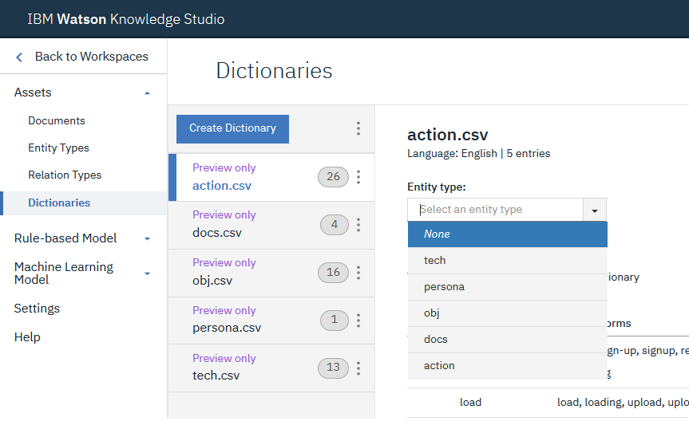

# NLP Hands-on Workshop Series - Session 2

**Creating a custom language model to optimize NLP results**

Tuesday, November 5 | 10:45 - 12:15 | Holly & Butternut

&nbsp;

### Section A
\[Do this section in IBM Watson Knowledge Studio]

Open the Knowledge Studio web GUI, then create an <b>entities and relations</b> workspace:

<ol>
<li>Click <b>create an entities and relations workspace</b></li>
<li>Assign the workspace a name and finish</li>
</ol>

#### &rarr; A.1 Define entities
Define the types of word we care about (_entities_) and supply some examples of those words (_dictionaries_).

<ol>
<!-- step -->
<li>
On the <b>Entity Types</b> page, add the following entity types:

<ul>
<li>action</li>
<li>docs</li>
<li>obj</li>
<li>persona</li>
<li>tech</li>
</ul>

Do not edit the Roles or Subtypes.

</li>
<!-- Step -->
<li>
On the <b>Dictionaries</b> page:

<ol>
<li>Download each of these dictionaries to your local computer, then upload them to Watson Knowledge Studio:
<ul>
<li><a href="https://github.com/spackows/CASCON-2019_NLP-workshops/blob/master/custom-language-model/dictionaries/action.csv"><code>actions.csv</code></a></li>
<li><a href="https://github.com/spackows/CASCON-2019_NLP-workshops/blob/master/custom-language-model/dictionaries/docs.csv"><code>docs.csv</code></a></li>
<li><a href="https://github.com/spackows/CASCON-2019_NLP-workshops/blob/master/custom-language-model/dictionaries/obj.csv"><code>obj.csv</code></a></li>
<li><a href="https://github.com/spackows/CASCON-2019_NLP-workshops/blob/master/custom-language-model/dictionaries/persona.csv"><code>persona.csv</code></a></li>
<li><a href="https://github.com/spackows/CASCON-2019_NLP-workshops/blob/master/custom-language-model/dictionaries/tech.csv"><code>tech.csv</code></a></li>
</ul></li>
<li>For each dictionary, select the dictionary and associate the dictionary with the entity type of the same name</li>
</ol>

<b>Note:</b> You have to upload the dictionaries one at a time by selecting <b>Upload Dictionary</b> from the menu.

</li>
</ol>

#### &rarr; A.2 Provide sample customer messages
On the <b>Documents</b> page:
<ol>
<li>
Download this document set to your local computer: <a href="https://github.com/spackows/CASCON-2019_NLP-workshops/blob/master/custom-language-model/document-set/customer-messages-documents.zip">customer-messages-documents.zip</a>

<b>Note:</b> Uncompress the .zip file into individual .txt files on your local computer
</li>
<li>In Watson Knowledge Studio, click <b>Import Document Set</b> and then upload the 18 .txt files you downloaded in the prerequisites</li>
<li>Rename the document set "Document set 1"</li>
</ol>

<b>Note:</b> Do not upload the .zip file itself.  Upload the 18 .txt files in one upload action as a set.

#### &rarr; A.3 Process files & train model
<ol>
<!-- Step -->
<li>
On the <b>Pre-annotation</b> page (under the <b>Machine Learning Model</b> menu  item):

<ol>
<li>Click <b>Apply This Pre-annotator</b></li>
<li>When prompted, select "Document set 1" and then click <b>Run</b></li>
</ol>
</li>
<!-- Step -->
<li>
On the <b>Performance</b> page:

<ol>
<!-- <li>Click <b>Train and evaluate</b></li> -->
<li>Select all documents, and then click <b>Train and evaluate</b></li>
</ol>
</li>
</ol>

#### &rarr; A.4 Deploy model

On the <b>Versions</b> page:

<ol>
<li>Click <b>Create version</b></li>
<li>Deploy the snapshot version you just created to your IBM Watson Natural Language Understanding service instance

<b>Note</b>: If you cannot find your NLU service instance in <b>Spaces</b> try looking in <b>Resource groups</b>.
</li>
</ol>

  

&nbsp;

### Section B
\[Do this section in IBM Watson Studio]

Create a project in Watson Studio from the sample project.

<ol>
<!-- step -->
<li>

Download this sample project to your local computer: 
<a href="https://github.com/spackows/CASCON-2019_NLP-workshops/raw/master/sample-projects/CASCON-2019-NLP-Workshop-2-Tuesday.zip">CASCON-2019-NLP-Workshop-2-Tuesday.zip</a>

</li>
<!-- step -->
<li>

In Watson Studio, create a new project "from a sample or file":

<ol>
<li>Upload the sample project .zip file</li>
<li>Give the project a name</li>
<li>If you don't already have Cloud Object Storage set up, follow the prompts to create an instance of Cloud Object Storage for the project</li>
<li>Click <b>Create</b></li>
</ol>
</li>
</ol>

**Demo video** 
[Create project from sample](https://youtu.be/UWGZPVKFk1o)

&nbsp;

